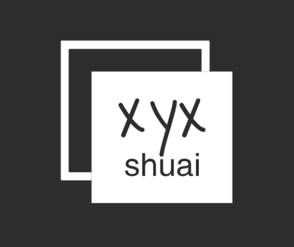

	

## GoudanXi前端周刊
- 😁 每3周至少一篇技术分享在[Issues](https://github.com/Xpig4432xyx/blog/issues)，希望能够给一起走在前端路上的你带来一点小小的帮助 ⸝⸝⸝⸝◟̆◞̆♡
- ✍️ 文章均为原创，可能来自基础回顾、工作总结、新技术探索等等 ଲଇଉକ
- ❓ 有问题可以在文章下面留言，我们尽可能解答 ⚆_⚆
- 📩 [Watch](https://github.com/Xpig4432xyx/blog/watchers) 即可自动订阅，新文章发布后第一时间推送到您的邮箱 ʕ•̫͡•ོʔ•̫͡•ཻʕ•̫͡•ʔ•͓͡•ʔ
- 💖 开源需动力，[Star](https://github.com/Xpig4432xyx/blog/stargazers) 是最好的赞美 ❛‿˂̵✧

### 近期weekly
- [【react源码解读】- 组件的实现](https://github.com/Xpig4432xyx/blog/issues/5)
- [【从前端到全栈】- koa快速入门指南](https://github.com/Xpig4432xyx/blog/issues/4)
- [7分钟理解JS的节流、防抖及使用场景](https://github.com/Xpig4432xyx/blog/issues/3)
- [浅谈web前端的发展趋势](https://github.com/Xpig4432xyx/blog/issues/2)
- [10分钟了解JS堆、栈以及事件循环的概念](https://github.com/Xpig4432xyx/blog/issues/1)

### 欢迎参与
如果你也恰好热爱技术、喜欢写文章，欢迎一起投稿，格式请按照ISSUE_TEMPLATE[发布新文章](https://github.com/Xpig4432xyx/blog/issues/new)，让我们一起帮助更多人！
